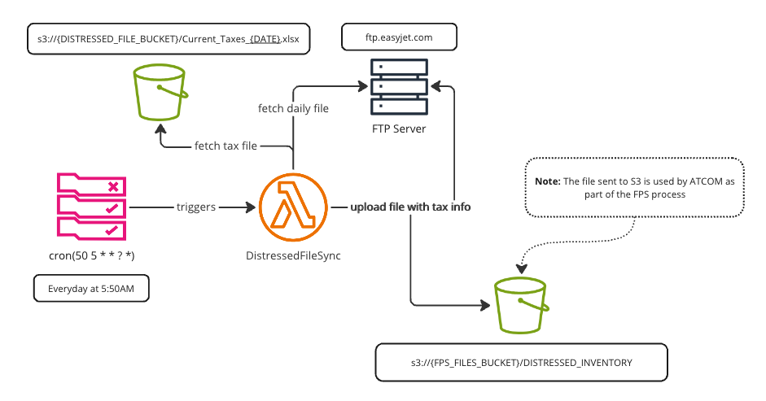

# DistressedFileSync Lambda

This AWS Lambda function handles processing of “tax distressed” files from an FTP location, calculates tax values based on another tax file from an S3 bucket, enriches the “tax distressed” file with these values, and uploads the result back to the FTP location and optionally to S3(for logging or testing). It handles encryption and decryption of files using PGP keys stored in AWS Secrets Manager.

