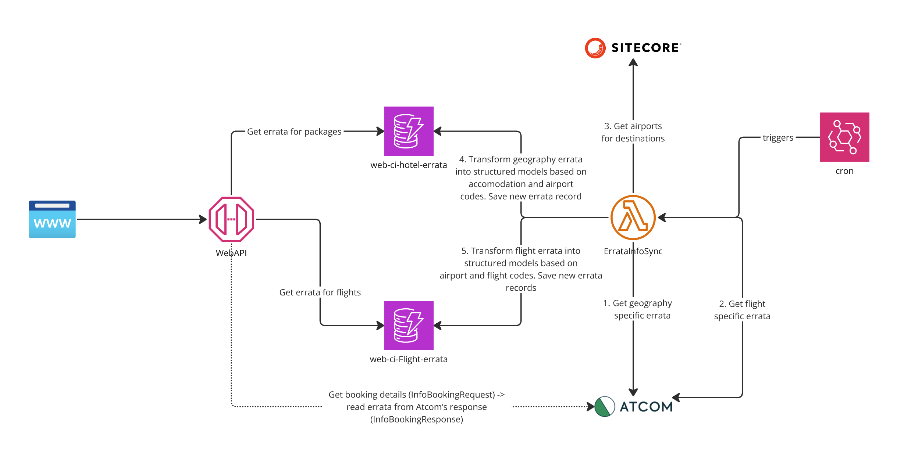

# Web - ErrataInfoSync lambda

This AWS Lambda function synchronizes errata information by fetching data from Atcom database and saving it to DynamoDB. WebAPI then uses the prepared structured data to return errata info in case this is relevant to specific packages or flights. This is done to get around the restriction on the lack of erratа information when querying the Atcom cache.  

> **_NOTE:_** WebAPI returns errata from the Atcom’s response (InfoBookingResponse), when requesting booking details from Atcom (InfoBookingRequest), not from DynamoDB. 



## Running locally

Running locally (example for `ejh-web-dev`):

1. Review `.config.local.tfbackend` file. Make sure that you have AWS CLI profile with name mentioned there.
2. Initialize terraform:
    ```
    just init
    ```
3. Select workspace:
    ```
    just workspace
    ```
4. Plan changes:
    ```
    just plan
    ```
5. Apply changes:
    ```
    just apply
    ```
