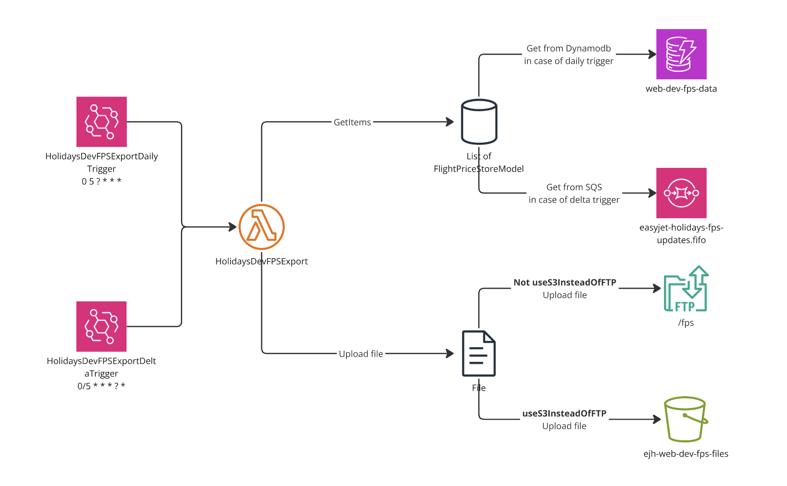

# Global - FPSExport lambda



## Running locally

**Important**: Make sure that your AWS cli is set up for NLZ accounts.

Running locally:

1. Review `.config.local.tfbackend` file. Make sure that you have AWS CLI profile with name mentioned there.
2. Initialize terraform:
    ```
    just init
    ```
3. Select workspace:
    ```
    just workspace
    ```
4. Plan changes:
    ```
    just plan
    ```
5. Apply changes:
    ```
    just apply
    ```
