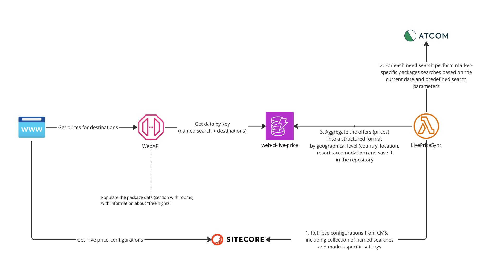

# Global - LivePriceSync lambda

This Lambda function is designed to synchronize and aggregate packages pricing data from Atcom based on pre-configured «named searches» (essentially a set of search parameters: destination, start date, duration, etc.) in CMS(Sitecore) to be consumed by WebAPI. It fetches current offers from Atcom for each market specific «named search», structure these offers into a quick-access format sorted by geography and the lowest price and save into AWS DynamoDB.



## How to run locally

Running locally (example for `ejh-web-dev`):

1. Review `.config.local.tfbackend` file. Make sure that you have AWS CLI profile with name mentioned there.
2. Initialize terraform:
    ```
    just init
    ```
3. Select workspace:
    ```
    just workspace
    ```
4. Plan changes:
    ```
    just plan
    ```
5. Apply changes:
    ```
    just apply
    ```
