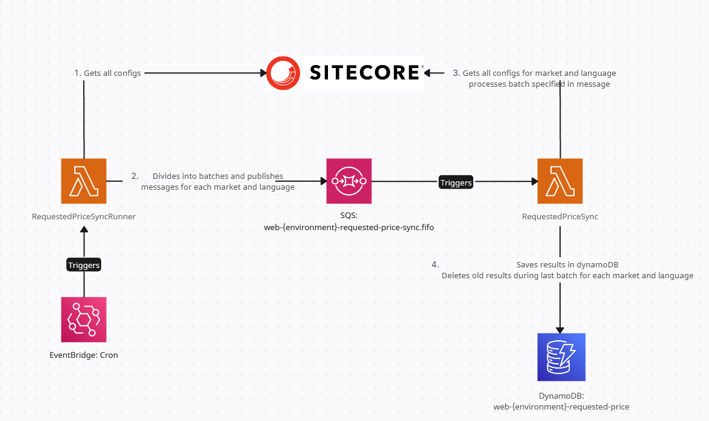

# Web - RequestedPriceSync lambda



## How to run locally

Running locally (example for `ejh-web-dev`):

1. Review `.config.local.tfbackend` file. Make sure that you have AWS CLI profile with name mentioned there.
2. Initialize terraform:
    ```
    just init
    ```
3. Select workspace:
    ```
    just workspace
    ```
4. Plan changes:
    ```
    just plan
    ```
5. Apply changes:
    ```
    just apply
    ```
