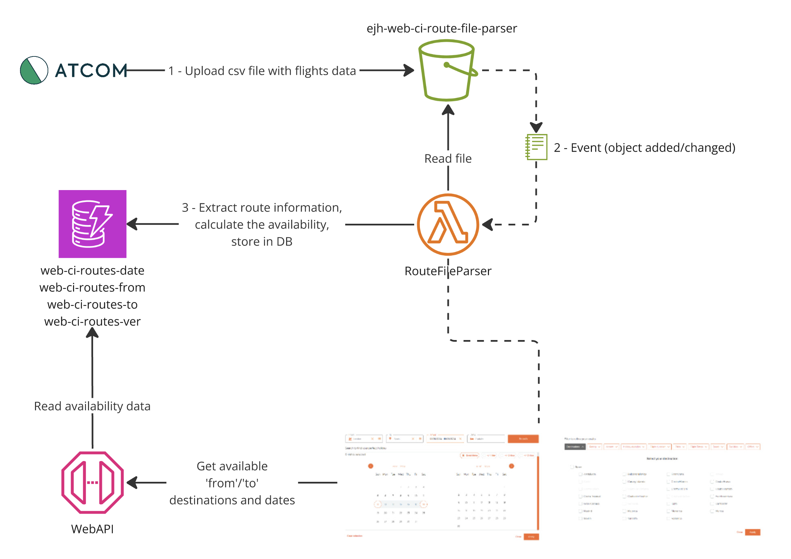

# RouteFileParser lambda

This AWS Lambda function processes route schedule files uploaded to AWS S3 bucket in a CSV structured format. It calculates the availability of routes(flights) based on departure and arrival information, storing this data into DynamoDB for downstream usage such as “search bar”, flights calendar, destinations filter, etc.

###### CI Environment:
